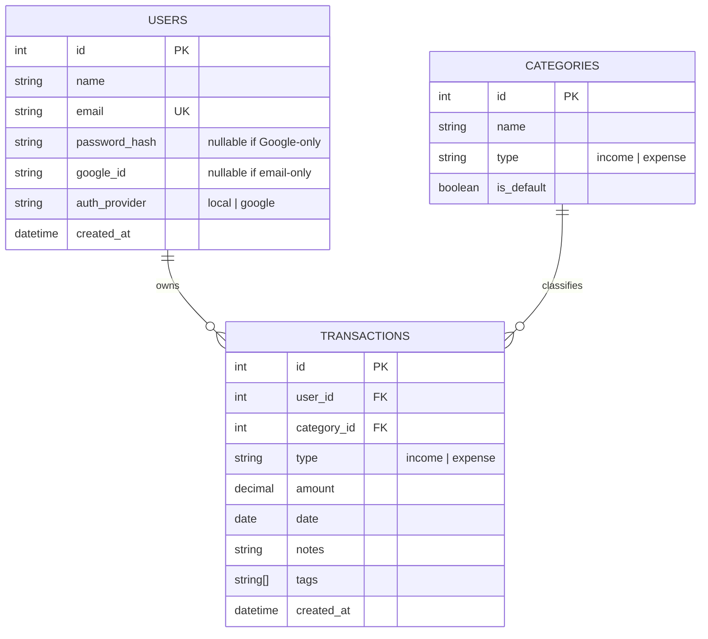

# 💰 Expense Tracker / Expense Analyzer — Project Planning & Design Document

**Type:** Internship Assignment — MVP
**Stack:** React + Bootstrap 5 · Node.js + Express.js · PostgreSQL + Prisma · Chart.js/Recharts
**Auth:** Google OAuth 2.0 + Email/Password (multi-user)

---

## 1. Project Overview

A web-based expense tracker where users manually log income and expenses, organize them into categories, and view real-time balance, totals, and visual analytics. All data is entered manually — no bank sync, no OCR, no AI. Built with a relational database (PostgreSQL) to reinforce core DBMS concepts: keys, constraints, joins, aggregation, and normalization.

---

## 2. Feature Breakdown

### 2.1 ✅ Required Features (MVP)

| # | Feature | Details |
|---|---|---|
| 1 | **Authentication** | Sign up / login via Email+Password **and** Google OAuth 2.0 |
| 2 | **Add Transaction** | Type (Income/Expense), Amount, Category, Date, Notes, Tags |
| 3 | **Delete Transaction** | Remove any transaction owned by the logged-in user |
| 4 | **View Transactions** | List all transactions, filterable by type/category/date |
| 5 | **Dashboard Summary** | Current Balance, Total Income, Total Expenses |
| 6 | **Default Categories** | Seeded Expense & Income categories (see §2.1.1) |
| 7 | **Analytics/Charts** | Pie (by category), Bar (monthly), Line (trend) |
| 8 | **Data Persistence** | PostgreSQL via Prisma ORM |

#### 2.1.1 Default Categories

- **Expense:** Food, Bills, Travel, Shopping, Entertainment, Health, Others
- **Income:** Salary, Freelancing, Business, Others

### 2.2 🚀 Future Improvements / Out of Scope for MVP

| Category | Deferred Features |
|---|---|
| Intelligence | AI categorization, OCR/receipt scanning, budget prediction, forecasting |
| Integrations | Bank APIs, SMS parsing, payment gateways |
| Notifications | Push notifications, scheduled email reports |
| Money Management | Multi-currency, subscription tracking, investments, net worth tracking |
| Collaboration | Shared wallets, family accounts |
| Data | Offline sync, custom user-defined categories |
| Auth extras | Password reset flow, email verification, 2FA |

> Rule of thumb used throughout: *"Is this necessary for the MVP?"* — if not, it's listed here, not built.

---

## 3. Pages & UI Structure

**Total pages: 6 core pages + 1 modal/drawer component**

| # | Page | Route | Purpose / Contents |
|---|---|---|---|
| 1 | **Login** | `/login` | Email + password fields, "Continue with Google" button, link to Signup |
| 2 | **Signup** | `/signup` | Name, Email, Password, Confirm Password, "Continue with Google" button |
| 3 | **Dashboard** | `/dashboard` | Balance card, Total Income card, Total Expense card, mini Pie chart (category split), recent 5 transactions list, "Add Transaction" button |
| 4 | **Transactions** | `/transactions` | Full paginated table of all transactions, filters (type, category, date range), delete action per row |
| 5 | **Add/Edit Transaction** | Modal (opened from Dashboard/Transactions) | Type toggle (Income/Expense), Amount, Category dropdown, Date picker, Notes textarea, Tags input |
| 6 | **Analytics** | `/analytics` | Pie chart (Expenses by Category), Bar chart (Monthly Expenses), Line chart (Expense Trend over time) |
| 7 | **Profile / Settings** | `/profile` | Logged-in user info (name, email, avatar if Google), Logout button |

---

## 4. System Design

### 4.1 High-Level Architecture

```
[ React SPA (Bootstrap 5) ]
         │  Axios (REST, JWT in httpOnly cookie / header)
         ▼
[ Express.js API Server ]
   ├── Auth Middleware (JWT verify)
   ├── Controllers → Services → Prisma Client
   └── Passport.js (Google OAuth strategy)
         │
         ▼
[ PostgreSQL Database ]
```

- **Auth flow:** Email/password → bcrypt-hashed password stored, JWT issued on login. Google OAuth → Passport.js `google-oauth20` strategy → find-or-create user → JWT issued the same way. Both paths converge on a single JWT session, so the rest of the app doesn't care which method was used.
- **Session strategy:** Stateless JWT (in httpOnly cookie) — avoids server-side session storage, keeps MVP simple.

### 4.2 Backend Design

#### 4.2.1 Folder Structure

```
backend/
├── src/
│   ├── config/
│   │   ├── passport.js        # Google OAuth strategy config
│   │   └── db.js               # Prisma client instance
│   ├── routes/
│   │   ├── auth.routes.js
│   │   ├── transaction.routes.js
│   │   ├── category.routes.js
│   │   └── analytics.routes.js
│   ├── controllers/
│   │   ├── auth.controller.js
│   │   ├── transaction.controller.js
│   │   └── analytics.controller.js
│   ├── services/               # business logic, DB queries via Prisma
│   │   ├── auth.service.js
│   │   ├── transaction.service.js
│   │   └── analytics.service.js
│   ├── middlewares/
│   │   ├── authMiddleware.js   # JWT verification
│   │   ├── errorHandler.js
│   │   └── validate.js         # request validation (e.g. Zod/Joi)
│   ├── utils/
│   │   └── jwt.js
│   └── app.js
├── prisma/
│   ├── schema.prisma
│   └── seed.js                 # seeds default categories
└── server.js
```

#### 4.2.2 API Design

**Auth**

| Method | Endpoint | Description |
|---|---|---|
| POST | `/api/auth/signup` | Register with name, email, password |
| POST | `/api/auth/login` | Login with email + password |
| GET | `/api/auth/google` | Redirect to Google OAuth consent screen |
| GET | `/api/auth/google/callback` | Google OAuth callback → issues JWT |
| POST | `/api/auth/logout` | Clear session/cookie |
| GET | `/api/auth/me` | Return current logged-in user |

**Transactions** *(all require auth)*

| Method | Endpoint | Description |
|---|---|---|
| GET | `/api/transactions` | List all transactions for user (supports `?type=`, `?category=`, `?from=&to=`) |
| GET | `/api/transactions/:id` | Fetch a single transaction (used to pre-fill the Edit modal) |
| POST | `/api/transactions` | Create a transaction |
| PUT | `/api/transactions/:id` | Update a transaction (ownership checked) |
| DELETE | `/api/transactions/:id` | Delete a transaction (ownership checked) |

**Categories**

| Method | Endpoint | Description |
|---|---|---|
| GET | `/api/categories` | List default categories (optionally filtered by `type`) |

**Dashboard / Analytics**

| Method | Endpoint | Description |
|---|---|---|
| GET | `/api/dashboard/summary` | Returns `{ balance, totalIncome, totalExpense }` |
| GET | `/api/analytics/by-category` | Expense totals grouped by category (Pie chart) |
| GET | `/api/analytics/monthly` | Expense totals grouped by month (Bar chart) |
| GET | `/api/analytics/trend` | Expense trend over time (Line chart) |

#### 4.2.3 Environment Variables

| Variable | Used For |
|---|---|
| `DATABASE_URL` | PostgreSQL connection string (Prisma) |
| `JWT_SECRET` | Signing/verifying JWTs |
| `GOOGLE_CLIENT_ID` / `GOOGLE_CLIENT_SECRET` | Passport.js Google OAuth strategy |
| `CLIENT_URL` | Allowed origin for CORS + OAuth redirect |
| `PORT` | Express server port |

### 4.3 Database Design

#### 4.3.1 ER Diagram



#### 4.3.2 Schema Notes (DBMS reasoning)

- **`users.email`** → `UNIQUE` constraint, indexed — enforces one account per email, fast login lookups.
- **`password_hash` / `google_id` nullable** → a user authenticated purely via Google never has a password; a local user never has a `google_id`. `auth_provider` disambiguates which flow to expect.
- **`categories` seeded once** (via `prisma/seed.js`), referenced by all users — normalized instead of storing category as a raw string on `transactions`, so you get real **foreign key** practice and can `JOIN` + `GROUP BY category_id` for analytics.
- **`transactions.user_id` FK with `ON DELETE CASCADE`** → deleting a user cleans up their transactions (referential integrity).
- **`tags`** kept as a native Postgres `text[]` column — avoids a many-to-many join table for MVP simplicity, while still being a genuinely relational (non-JSON-blob) choice.
- **Indexes:** `transactions(user_id, date)` composite index — the dashboard/analytics queries filter by user and often sort/group by date, so this keeps aggregate queries fast as data grows. A separate index on `transactions(category_id)` supports the `by-category` analytics query, which does `GROUP BY category_id`.
- **Analytics queries** are a direct showcase of `GROUP BY`, `SUM()`, `ORDER BY`, and date-truncation functions (`DATE_TRUNC('month', date)`) — good talking points for your mentor on the DBMS side.
- **JWT session lifetime:** tokens are short-lived (e.g. **7 days**), stored in an httpOnly cookie. No refresh-token rotation for MVP — on expiry, the user simply logs in again. Keeps auth simple without sacrificing security.

### 4.4 Frontend Design

#### 4.4.1 Folder Structure

```
frontend/
├── src/
│   ├── pages/
│   │   ├── Login.jsx
│   │   ├── Signup.jsx
│   │   ├── Dashboard.jsx
│   │   ├── Transactions.jsx
│   │   ├── Analytics.jsx
│   │   └── Profile.jsx
│   ├── components/
│   │   ├── TransactionModal.jsx
│   │   ├── TransactionTable.jsx
│   │   ├── SummaryCard.jsx
│   │   ├── charts/
│   │   │   ├── CategoryPieChart.jsx
│   │   │   ├── MonthlyBarChart.jsx
│   │   │   └── TrendLineChart.jsx
│   │   └── Navbar.jsx
│   ├── features/               # state slices (Redux Toolkit or Context)
│   │   ├── authSlice.js
│   │   └── transactionSlice.js
│   ├── services/                # Axios API calls
│   │   ├── authApi.js
│   │   ├── transactionApi.js
│   │   └── analyticsApi.js
│   ├── routes/
│   │   └── ProtectedRoute.jsx
│   ├── hooks/
│   │   └── useAuth.js
│   └── App.jsx
```

#### 4.4.2 State Management

- Lightweight **Redux Toolkit** (or React Context if you want to keep it minimal) for: `auth` (user, token) and `transactions` (cached list + summary).
- Charts and analytics pages fetch fresh from `/api/analytics/*` on mount — no need to duplicate that logic in global state.

---

## 5. Gemini Image Generation Prompts

Use these with Gemini's image generation to create clean UI mockup visuals for your slides. Each prompt is self-contained.

**1. Login Page**
> "A clean, modern web app login page UI mockup for a finance/expense tracker. Centered white card on a soft gradient background (blue to purple). Fields: Email, Password, a filled blue 'Log In' button, a 'Continue with Google' button with Google logo below it, and a small 'Don't have an account? Sign up' link. Minimal, professional SaaS design, Bootstrap-style, plenty of whitespace, sans-serif typography."

**2. Signup Page**
> "A modern web app signup page UI mockup for a finance/expense tracker. Centered card layout with fields for Name, Email, Password, Confirm Password, a filled blue 'Create Account' button, and a 'Continue with Google' button with Google logo. Clean SaaS aesthetic, soft shadows, rounded corners, light background."

**3. Dashboard Page**
> "A financial dashboard UI mockup for an expense tracker web app. Top row: three summary cards labeled 'Current Balance', 'Total Income', 'Total Expenses' with large bold numbers and small icons. Below: a donut/pie chart showing expense breakdown by category with a colorful legend, next to a recent transactions list with category icons, amounts in green/red, and dates. A prominent blue '+ Add Transaction' button top-right. Clean Bootstrap-style dashboard, light theme, card-based layout."

**4. Transactions List Page**
> "A transactions table page UI mockup for an expense tracker web app. Full-width data table with columns: Date, Category (with colored tag), Type (Income/Expense badge), Amount, Notes, and a red trash-icon delete button per row. Filter bar above the table with dropdowns for Type, Category, and a date range picker. Pagination controls at the bottom. Clean, modern, minimal SaaS table design."

**5. Add/Edit Transaction Modal**
> "A modal popup UI mockup for adding a transaction in a finance app. Centered modal overlay on a dimmed background. Contains: a toggle switch for Income/Expense, Amount input with currency symbol, Category dropdown, Date picker field, Notes textarea, Tags input with chip-style tags, and 'Cancel' / 'Save Transaction' buttons at the bottom. Rounded corners, soft shadow, clean modern SaaS modal design."

**6. Analytics Page**
> "An analytics dashboard UI mockup for an expense tracker web app. Three chart sections stacked or in a grid: a colorful pie chart labeled 'Expenses by Category', a bar chart labeled 'Monthly Expenses' with months on the x-axis, and a line chart labeled 'Expense Trend Over Time' with a smooth upward/downward line. Light background, card containers around each chart, clean modern data-visualization SaaS style."

**7. Profile / Settings Page**
> "A user profile settings page UI mockup for a web app. Left-aligned circular avatar image, user's name and email displayed next to it, an 'Auth Provider: Google' or 'Email' badge, and a red 'Logout' button below. Minimal card layout, plenty of whitespace, clean modern SaaS design."

---

## 6. Suggested Presentation Outline

1. **Problem & Goal** — what the tracker solves, why manual-entry MVP
2. **Feature Scope** — required vs. future (Section 2)
3. **Page Walkthrough** — the 6 pages + mockup images (Section 3 + 5)
4. **System Architecture** — client/server/DB diagram (Section 4.1)
5. **Database Design** — ER diagram + DBMS reasoning (Section 4.3) — this is your strongest section given the DBMS learning goal
6. **API Design** — endpoint table (Section 4.2.2)
7. **Next Steps** — implementation roadmap, ask for sign-off to start building

---

*This document is the single source of truth for planning. Implementation will proceed phase by phase (DB schema → Auth → Backend API → Frontend pages → Charts) with mentor/architect review at each step.*
